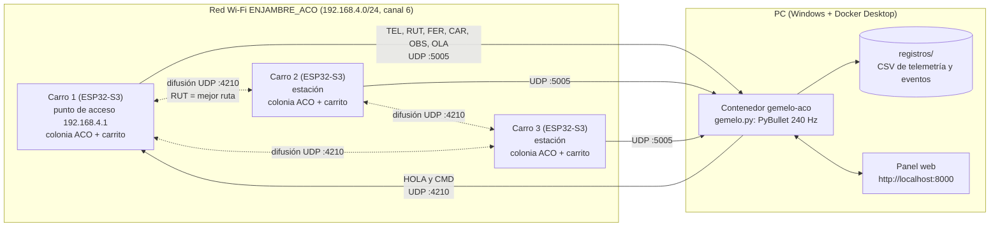
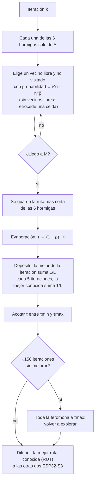
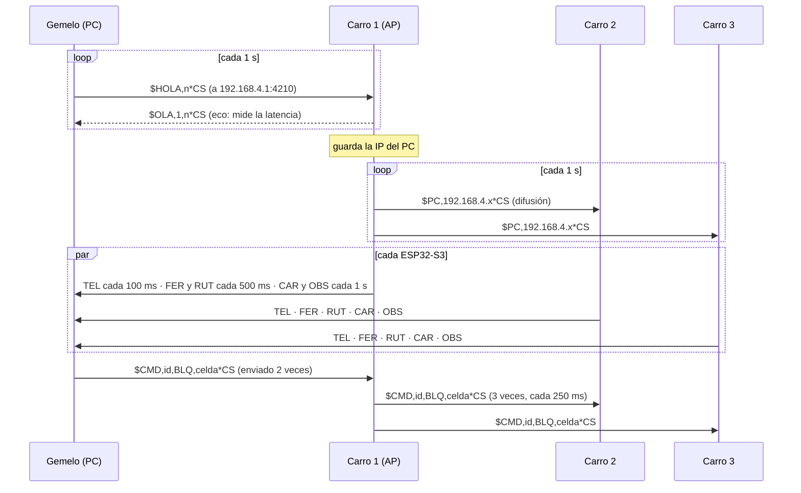
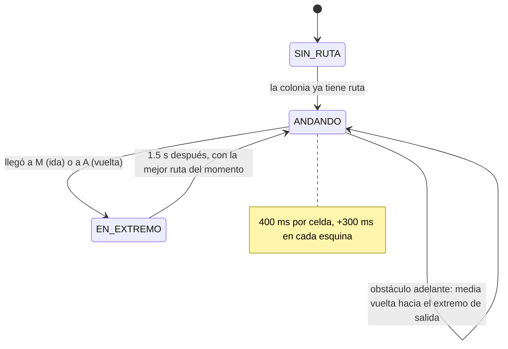

# Enjambre de 3 carritos con algoritmo de hormigas (ACO) en ESP32-S3 y gemelo digital en PyBullet

**Trabajo en grupo:**

Tres ESP32-S3 forman un **enjambre**. Cada una es el "cerebro" de un carrito que debe encontrar la ruta más corta entre la entrada **A** y la meta **M** de un almacén con forma de laberinto. Para eso, cada ESP32-S3 corre **su propia colonia de hormigas** (*Ant Colony Optimization*, variante MAX-MIN) y las tres se ayudan por Wi-Fi: el carro 1 crea la red en **modo AP** y cada tarjeta difunde su mejor ruta, que las otras dos depositan como **feromona** en su propio mapa. Todo se replica en un **gemelo digital** en PyBullet que corre dentro de **Docker**: los 3 carritos virtuales de tracción diferencial, la feromona pintada en el piso y un panel web para dar órdenes al enjambre.

**No hay montaje físico.** Las 3 placas van solas, conectadas solo por su cable USB. Lo único que se usa de cada una es su **LED RGB integrado** y su **botón BOOT**.

| Parte | Qué hace | Hardware | Software |
|---|---|---|---|
| **Enjambre** (mundo físico) | 3 colonias ACO, una en cada ESP32-S3, que se ayudan compartiendo rutas por UDP. Cada placa emula el movimiento de su carrito | Carro 1, Carro 2 y Carro 3: ESP32-S3 DevKitC-1, sin cableado externo | Firmware C++ (PlatformIO, Arduino) con una librería propia que no depende de Arduino |
| **Red** | El carro 1 crea la red `ENJAMBRE_ACO` (modo AP). Los otros dos se conectan como estaciones y el PC se une a la misma red | Wi-Fi 2.4 GHz de las ESP32-S3 | UDP con tramas de texto `$TIPO,...*CS` |
| **Gemelo digital** (parte virtual) | Reproduce el laberinto, los 3 carritos y la feromona en PyBullet, guarda registros y muestra un panel web con mandos para las ESP32-S3 | PC con Docker Desktop | Python: PyBullet + panel web propio, en Docker |

**Resultados de la validación** (detalle en la [sección 7](#7-resultados)):

| | Resultado |
|---|---|
| Firmware | Compila para ESP32-S3: **16.9 % de la RAM** (55 700 B) y **53 % de la flash** (700 625 B) |
| Cooperación (núcleo ACO en el PC, 300 repeticiones) | Para que **las 3** colonias tengan la ruta óptima: **mediana 7 iteraciones compartiendo** contra **30 aisladas** (4.3 veces más rápido). Peor caso: 31 contra 248 |
| Cooperación (sistema completo virtual en Docker) | 6 ensayos por modo con las 3 placas: cada una llegó a la ruta óptima en una **mediana de 6.5 iteraciones compartiendo** contra **12 aisladas**. Para que **las 3** la tengan: mediana 6.5 contra 25; peor ensayo 11 contra 185 |
| Seguimiento del gemelo | El carrito de PyBullet va a una mediana de **0.23 m** de la posición de su ESP32 (1 celda = 25 cm). En 9 minutos de sesión con reinicios y obstáculos tuvo que resincronizarse 6 veces |
| Obstáculos | Al bloquear un pasillo desde el panel, las 3 colonias buscan otra ruta y el carrito que lo encuentra da media vuelta |

---

## Contenido

1. [Arquitectura general](#1-arquitectura-general)
2. [El enjambre: qué hace y cómo se ve](#2-el-enjambre-qué-hace-y-cómo-se-ve)
3. [El algoritmo de hormigas (ACO MAX-MIN)](#3-el-algoritmo-de-hormigas-aco-max-min)
4. [Red y protocolo de comunicación](#4-red-y-protocolo-de-comunicación)
5. [Gemelo digital en PyBullet y Docker](#5-gemelo-digital-en-pybullet-y-docker)
6. [Análisis](#6-análisis)
7. [Resultados](#7-resultados)
8. [Materiales y software](#8-materiales-y-software)
9. [Paso a paso para replicarlo](#9-paso-a-paso-para-replicarlo)
10. [Explicación del código](#10-explicación-del-código)
11. [Estructura del repositorio](#11-estructura-del-repositorio)
12. [Problemas comunes y soluciones](#12-problemas-comunes-y-soluciones)
13. [Conclusiones](#13-conclusiones)
14. [Referencias](#14-referencias)

---

## 1. Arquitectura general

Las **ESP32-S3 hacen el cálculo**: cada una corre su colonia de hormigas, mueve su carrito y se comunica con las otras dos. El **PC solo observa y da órdenes**: no calcula rutas, reproduce en PyBullet lo que dicen las placas, guarda los registros y envía comandos desde el panel.



Cada ESP32-S3 es autónoma: si el PC se apaga, las tres siguen buscando la ruta y compartiendo. Si una se apaga, las otras dos siguen, y cuando vuelve aprende la ruta de ellas en pocas iteraciones.

---

## 2. El enjambre: qué hace y cómo se ve

### 2.1 Qué hace

1. El **carro 1** crea la red `ENJAMBRE_ACO`. El **carro 2** y el **carro 3** se conectan a ella.
2. Cada ESP32-S3 hace una **iteración de su colonia cada 500 ms**: 6 hormigas recorren el laberinto de A a M y la mejor deja feromona.
3. Después de cada iteración, la placa **difunde su mejor ruta conocida**. Las otras dos revisan que sea válida y la depositan en su mapa con la mitad del peso de una propia. Si es más corta que la suya, la adoptan.
4. Cada ESP32-S3 mueve **su carrito** de A a M y de vuelta por la mejor ruta que conoce, a 400 ms por celda de 25 cm (0.63 m/s), con una pausa de 300 ms en cada esquina y de 1.5 s en cada extremo.
5. El **gemelo digital** se anuncia al carro 1. Desde ese momento las 3 placas le envían su telemetría y el gemelo mueve los 3 carritos de PyBullet detrás de cada una.
6. Desde el **panel web** se reinician las colonias, se activa o se apaga el intercambio ("Compartir" o "Aisladas"), se cambian el periodo de iteración y la velocidad, y se ponen o quitan **obstáculos** con un clic en el mapa.
7. Con un obstáculo, todas las colonias borran esa celda de su mapa y buscan otra ruta. Si un carrito lo encuentra justo delante, **da media vuelta** y regresa al extremo de donde salió; el siguiente viaje ya usa la ruta nueva.

Cada placa muestra su estado con el **LED RGB integrado** (GPIO48 o GPIO38, según la versión de la DevKitC-1):

| Color | Significado |
|---|---|
| **Azul** un instante al encender | El LED funciona |
| **Rojo** parpadeando | Sin Wi-Fi (carros 2 y 3) |
| **Naranja** fijo | En la red, pero el PC aún no se ha anunciado |
| **Verde** fijo | Todo en orden |
| Destello **azul** | Llegó una ruta de otra ESP32-S3 |
| Destello **morado** | Obstáculo: comando de bloqueo o media vuelta del carrito |
| Botón **BOOT** (GPIO0) | Reinicia solo la colonia de esa placa, para ver cómo vuelve a aprender de las otras dos |

### 2.2 Videos de evidencia

_Agregar aquí los enlaces de los videos:_

- **Interfaz gráfica (gemelo digital y panel web):** _enlace_
- **Las 3 ESP32-S3 funcionando junto con la interfaz:** _enlace_

### 2.3 El almacén (laberinto)

El almacén mide 15 x 23 celdas de 25 cm (3.75 m x 5.75 m). Se generó con `herramientas/generar_laberinto.py` (semilla 3): un laberinto aleatorio al que se le abrieron 12 paredes para que haya **varios caminos**, porque en un laberinto con un solo camino no habría nada que optimizar.

<p align="center"></p>

| Dato | Valor |
|---|---|
| Celdas libres (pasillos + A + M) | 165 |
| Pasillos entre celdas (aristas con feromona) | 176 |
| Rutas posibles de A a M sin repetir celdas | **1 496** |
| Rutas óptimas | **1, de 36 pasos** |
| Siguientes en longitud | 6 rutas de 40 pasos, 18 de 44, 44 de 48 |
| Ruta más larga | 120 pasos |

Hay una sola ruta óptima y seis que solo son 4 pasos más largas, así que las hormigas encuentran rápido una de 40 y el verdadero trabajo del algoritmo es dar el último paso hasta 36. Además, la ruta óptima no es la que "apunta" a la meta: al principio se aleja de M, y eso confunde a la heurística.

El mismo laberinto está en tres sitios: `comun/laberinto.txt` (texto), `firmware/lib/enjambre/laberinto.h` (generado para las ESP32-S3) y el gemelo, que lee el `.txt`. Para comprobar que todos usan el mismo, cada placa envía el **CRC32 del mapa (`D5DB46D7`)** en su telemetría. Si no coincide, el panel avisa "Laberinto distinto".

### 2.4 Capturas

Panel web del gemelo digital con las 3 colonias en la ruta óptima:

<p align="center"></p>

Vista de PyBullet con un obstáculo (caja naranja) y la feromona del carro 1 en el piso:

<p align="center"></p>

*Capturas tomadas con las ESP32-S3 virtuales (el mismo firmware compilado para el PC). Con las tarjetas reales el panel es el mismo.*

Arriba están las 3 ESP32-S3: la mejor ruta de cada una, en qué iteración la encontró, las rutas recibidas y perdidas de las otras y la latencia. A la izquierda, la imagen de PyBullet en vivo. A la derecha, el mapa de feromona de la placa elegida, con la mejor ruta de cada una y la posición de cada carrito. Abajo, los comandos y la curva de convergencia.

---

## 3. El algoritmo de hormigas (ACO MAX-MIN)

### 3.1 La idea

Las hormigas reales encuentran el camino más corto a la comida sin un mapa. Cada una deja **feromona** en el suelo y las demás prefieren los caminos con más feromona. En un camino corto las hormigas van y vuelven más rápido, así que ese camino acumula feromona antes y atrae a más hormigas. La feromona además se **evapora**, y por eso los caminos malos se olvidan.

El algoritmo copia esa idea. Cada pasillo del laberinto (la unión entre dos celdas vecinas) tiene un valor de feromona `τ`. En cada iteración:



### 3.2 Regla de decisión

Una hormiga en la celda `u` pasa a una celda vecina `v` (libre, sin obstáculo y no visitada en esta ruta) con probabilidad:

```
            τ(u,v)^α · η(v)^β
p(u→v) = ───────────────────────          η(v) = 1 / (1 + |fila_v − fila_M| + |col_v − col_M|)
          Σ_w  τ(u,w)^α · η(w)^β
```

- `τ(u,v)` es la feromona del pasillo entre `u` y `v`: la **memoria colectiva** de qué tan usado ha sido por buenas rutas.
- `η(v)` es la **heurística**: qué tan cerca queda `v` de la meta en distancia Manhattan. Empuja a las hormigas hacia M, pero en un laberinto a veces hay que alejarse de M, así que no basta sola.
- Se usa `α = 1` y `β = 2`: la heurística pesa un poco más que la feromona. Si una hormiga llega a un callejón sin salida, retrocede una celda y prueba otro vecino.

### 3.3 Actualización de la feromona (MAX-MIN Ant System)

Se usa la variante **MAX-MIN** de Stützle y Hoos, que evita que el algoritmo se encierre en una ruta mala:

| Paso | Fórmula | Valor usado |
|---|---|---|
| Hormigas por iteración | — | 6 |
| Evaporación | `τ ← (1 − ρ) · τ` en todos los pasillos | `ρ = 0.05` |
| Depósito de la mejor hormiga de la iteración | `τ ← τ + 1/L_iter` en cada pasillo de su ruta | — |
| Depósito de la mejor ruta conocida | `τ ← τ + 1/L_mejor` | cada 5 iteraciones |
| Depósito de una ruta de otra ESP32-S3 | `τ ← τ + 0.5/L_externa` | peso 0.5 |
| Límite superior | `τmax = 1 / (ρ · L_mejor)` | — |
| Límite inferior | `τmin = τmax · (1 − p_dec) / ((L_mejor/2 − 1) · p_dec)`, con `p_dec = p_best^(1/L_mejor)` | `p_best = 0.2` |
| Al reiniciar | toda la feromona en `τmax = 1/(ρ · 165)`, con `τmin = τmax/12` | — |
| Estancamiento | si no mejora en 150 iteraciones, toda la feromona vuelve a `τmax` (se conserva la mejor ruta) | 150 iteraciones |

El límite inferior garantiza que **ningún pasillo quede con probabilidad cero**, y el superior impide que una ruta acapare toda la feromona. Empezar con todo en `τmax` hace que al principio las hormigas exploren casi al azar.

La feromona es **simétrica**: un pasillo vale lo mismo en los dos sentidos, porque el carrito lo recorre de ida y de vuelta.

Los valores de la tabla salieron de `pruebas/ajuste_aco.cpp`. Con 4 hormigas y `ρ = 0.1`, la colonia aislada se estancaba en una ruta de 40 pasos en uno de cada seis ensayos; con 6 hormigas, `ρ = 0.05`, `p_best = 0.2` y el reinicio por estancamiento, las 300 repeticiones llegaron a la óptima.

### 3.4 Cooperación entre las 3 ESP32-S3

Cada placa tiene una colonia independiente, con su propia semilla aleatoria, así que al principio cada una explora zonas distintas. La cooperación funciona así:

1. Al final de cada iteración, la placa difunde su **mejor ruta conocida** en una trama `RUT`.
2. Las otras dos la **validan**: debe empezar en A, terminar en M, avanzar entre celdas vecinas, no repetir celdas ni pasar por un obstáculo. Una ruta inválida se descarta.
3. La depositan con **peso 0.5** respecto a una ruta propia: la ruta ajena influye, pero no borra lo que la colonia aprendió.
4. Si es más corta que su mejor ruta, **la adoptan**. Desde ese momento también la difunden, y su carrito la usa en el siguiente viaje.
5. Cada `RUT` lleva el número del último reinicio general (**época**). Así, las rutas viejas que todavía vienen en camino justo después de un "Reiniciar" se descartan. Si una placa recibe una época más nueva que la suya (porque perdió el comando o se reinició), se pone al día sola.

La época se agregó después de ver un error en la validación: en el primer ensayo, una placa que aún no había recibido el reinicio le pasaba su ruta óptima vieja a las demás, y estas "llegaban" al óptimo en la iteración 0.

---

## 4. Red y protocolo de comunicación

### 4.1 Roles y direcciones

| Equipo | Modo Wi-Fi | IP | Escucha en |
|---|---|---|---|
| Carro 1 | Punto de acceso `ENJAMBRE_ACO`, clave `hormigas123`, canal 6 | 192.168.4.1 | UDP 4210 |
| Carro 2 | Estación | asignada por el carro 1 (192.168.4.x) | UDP 4210 |
| Carro 3 | Estación | asignada por el carro 1 | UDP 4210 |
| PC (gemelo en Docker) | Estación | asignada por el carro 1 | UDP 5005 y panel en TCP 8000 |

Entre las placas se usa **difusión UDP** (`192.168.4.255:4210`): una sola trama llega a las otras dos. Se eligió UDP y no TCP porque una ruta perdida no importa: medio segundo después llega la siguiente, que es igual o mejor. Esperar una retransmisión solo retrasaría todo.

### 4.2 Cómo encuentran las ESP32-S3 al PC

Las placas no conocen la IP del PC, que la asigna el carro 1 al conectarse. Por eso el PC se anuncia:



Los **comandos** del panel también pasan por el carro 1. El PC envía cada comando dos veces y el carro 1 lo difunde tres veces a las demás. Cada comando lleva un número `id`, y cada placa recuerda los últimos 8: si le llega repetido, lo aplica una sola vez.

### 4.3 Formato de las tramas

Todas las tramas son de texto:

```
$TIPO,campo1,campo2,...*CS
```

`CS` es el **XOR** de todos los caracteres entre `$` y `*`, en hexadecimal. Las rutas y la feromona viajan como bytes en hexadecimal: cada celda libre tiene un número de 0 a 164 (en orden de filas), así que una celda ocupa un byte.

| Tipo | Va de → a | Campos | Cada |
|---|---|---|---|
| `RUT` | ESP32-S3 → otras ESP32-S3 (y PC) | nodo, secuencia, época, iteración, pasos, ruta en hex | 500 ms |
| `TEL` | ESP32-S3 → PC | 29 campos: iteración, mejor largo, largo de la iteración, iteración de mejora, compartir, estado del carrito, sentido, celda del tramo, viaje, rutas recibidas y perdidas por nodo, tramas malas, enviadas, CRC del laberinto, periodo, velocidad, mejoras externas, obstáculos, reinicios por estancamiento, desvíos | 100 ms |
| `FER` | ESP32-S3 → PC | nodo, secuencia, iteración, 176 valores de feromona (0–255) | 500 ms |
| `CAR` | ESP32-S3 → PC | nodo, secuencia, viaje, sentido, desvío, ruta del tramo actual | al iniciar tramo y cada 1 s |
| `OBS` | ESP32-S3 → PC | nodo, secuencia, celdas bloqueadas | 1 s |
| `HOLA` / `OLA` | PC → carro 1 / respuesta | número de anuncio | 1 s |
| `PC` | carro 1 → otras ESP32-S3 | IP del PC | 1 s |
| `CMD` | PC → carro 1 → otras | id, acción, valor | al pulsar en el panel |

Tramas reales capturadas de la ESP32-S3 virtual del carro 2:

```
$TEL,2,447,46024,91,36,36,10,1,2,1,36,37,2,0,91,0,91,0,0,0,0,720,D5DB46D7,500,400,1,0,0,0*7B
$RUT,2,91,0,91,36,0001020304050607081721222324252F3D3E3F40414A5863717B8890A1A2A391898A8B92A4*5A
```

La `TEL` se lee así: carro 2, trama 447, 46 s encendido, iteración 91, mejor ruta de 36 pasos (la última iteración también dio 36), encontrada en la iteración 10, compartiendo, carrito en un extremo (estado 2) al terminar la vuelta (sentido 1) en la celda 37 de 37 de su segundo viaje, parado en la celda 0 del mapa (la entrada). Recibió 91 rutas del carro 1 y 91 del carro 3, sin pérdidas ni tramas malas, y lleva 720 tramas enviadas con el laberinto de CRC `D5DB46D7`. La `RUT` lleva la misma ruta de 36 pasos como 37 celdas en hexadecimal (`00` = entrada, `A4` = meta).

| Acción de `CMD` | Efecto |
|---|---|
| `RESET,época` | Reinicia las 3 colonias y empieza una época nueva |
| `RSTN,n` | Reinicia solo la colonia del nodo `n` |
| `COMP,1` / `COMP,0` | Compartir rutas / colonias aisladas |
| `PER,ms` | Tiempo entre iteraciones (50–5000 ms) |
| `VEL,ms` | Velocidad del carrito en ms por celda (50–3000) |
| `BLQ,celda` / `DBQ,celda` | Poner / quitar un obstáculo en esa celda |
| `LIBRE,0` | Quitar todos los obstáculos |

### 4.4 Detección de pérdidas

Cada placa numera sus tramas `RUT`. Si el carro 3 recibe la ruta 120 del carro 2 y después la 123, sabe que perdió 2 y lo suma a su contador. Así cada tarjeta mide la calidad del enlace con las otras dos y lo reporta en la telemetría; el panel lo muestra como "rutas recibidas / perdidas".

---

## 5. Gemelo digital en PyBullet y Docker

### 5.1 Qué hace el gemelo

`gemelo/gemelo.py` es el programa del PC. No calcula rutas: **reproduce lo que hacen las ESP32-S3**.

- **Escena:** el piso con una baldosa por celda, los muros como bloques y 3 carritos de tracción diferencial (`gemelo/carrito.urdf`: chasis de 12 x 10 cm, dos ruedas con motor de 3 cm de radio, dos apoyos esféricos y una baliza del color de cada carro).
- **Física a 240 Hz en tiempo real.** Cada carrito se controla con la velocidad de sus dos ruedas. El gemelo sabe qué ruta recorre su ESP32-S3 (trama `CAR`) y en qué celda va (trama `TEL`), y lleva el carrito hacia la siguiente celda: si el error de rumbo es grande gira en el sitio, si no avanza corrigiendo. Si se atrasa, acelera hasta 2.5 veces para alcanzar a su placa.
- **Un mundo físico por carrito.** Cada carrito vive en su propia simulación de PyBullet con el mismo laberinto, así que no chocan entre ellos (las ESP32-S3 tampoco "ven" a los otros carritos). La imagen junta a los tres.
- **Resincronización:** si el carrito virtual queda más de 10 celdas atrás o se atasca 6 s, se ubica directamente donde dice su ESP32-S3 y se registra un evento `RESINC`.
- **Feromona en el piso:** cada baldosa toma el color de la placa elegida en el panel, más intenso donde hay más feromona. Los obstáculos aparecen como cajas naranjas.
- **Imagen:** la cámara de PyBullet se renderiza en un **proceso aparte** (en Docker no hay tarjeta gráfica y el renderizado por software es lento), para que la física nunca se frene. El panel la recibe como video MJPEG.
- **Registros:** cada sesión crea `registros/sesion_AAAAMMDD_HHMMSS_telemetria.csv` (cada trama TEL, con la posición del carrito virtual y su distancia a la de su placa) y `..._eventos.csv` (mejoras, rutas óptimas, comandos, reinicios, obstáculos, latencias).

### 5.2 Por qué Docker

El gemelo usa PyBullet, NumPy y Pillow. Con Docker, los 3 integrantes lo ejecutan igual sin instalar Python ni resolver versiones: `docker compose build` crea la imagen una vez y `docker compose up` la levanta.

| Archivo | Para qué |
|---|---|
| `gemelo/Dockerfile` | Imagen `python:3.11-slim` con PyBullet 3.2.7, NumPy y Pillow |
| `docker-compose.yml` | Sistema real: publica el panel (`8000/tcp`) y la telemetría (`5005/udp`) y monta `registros/` |
| `docker-compose.virtual.yml` | Todo virtual: el gemelo + las 3 ESP32-S3 virtuales en otro contenedor |

### 5.3 ESP32-S3 virtuales

`nodos_virtuales/nodos_virtuales.cpp` compila **exactamente la misma librería del firmware** (`firmware/lib/enjambre`) para el PC, con una red simulada entre las 3 placas que puede perder paquetes y agregar retardo. Sirvió para desarrollar y validar el gemelo sin las tarjetas y para medir la cooperación con muchos ensayos. Como la colonia, el protocolo y el carrito son el mismo código C++, lo que se prueba en el PC es lo que corre en las ESP32-S3.

---

## 6. Análisis

### 6.1 Memoria de la colonia en la ESP32-S3

| Estructura | Tamaño |
|---|---|
| Feromona `tau[250][4]` (float, por celda y dirección) | 4 000 B |
| Vecinos `vec[250][4]` (byte por vecino) | 1 000 B |
| Tabla mapa → celda (`int16`, 1 024 entradas) | 2 048 B |
| Fila y columna de cada celda | 500 B |
| Mejor ruta, ruta de la iteración y ruta de la hormiga (250 B cada una) | 750 B |
| Celdas visitadas y bloqueadas | 500 B |
| **Total de la colonia** | **≈ 8.8 KB** |

El firmware completo usa **55 700 B de RAM (16.9 %)** en la ESP32-S3, incluida la pila Wi-Fi. Numerar las celdas libres (165 de 345) permite guardar una celda en un byte y una ruta completa en 37 bytes.

### 6.2 Carga de cálculo

Una iteración son 6 hormigas que dan entre 36 y unos 150 pasos cada una. En cada paso se revisan hasta 4 vecinos con dos multiplicaciones y una suma, más la evaporación y el acotado de 660 valores al final: unas **5 000 operaciones de punto flotante por iteración**. La ESP32-S3 tiene unidad de punto flotante y corre a 240 MHz, así que esto es una fracción mínima del periodo de 500 ms. El periodo no lo limita el cálculo: se eligió para que las rutas viajen por la red a un ritmo cómodo y la convergencia se pueda ver en vivo.

### 6.3 Ancho de banda

Tamaños medidos con `herramientas/probar_red.py` contra las ESP32-S3 virtuales:

| Flujo | Tamaño de la trama | Frecuencia | Por ESP32-S3 |
|---|---|---|---|
| `TEL` → PC | 92 B | 10 Hz | 920 B/s |
| `FER` → PC | 368 B | 2 Hz | 736 B/s |
| `RUT` → otras placas y PC | 93 B | 2 Hz (x2 destinos) | 372 B/s |
| `CAR` y `OBS` → PC | ~115 B y 13 B | 1 Hz | 128 B/s |
| **Total por ESP32-S3** | | | **≈ 2.2 KB/s** |

Las 3 juntas envían **≈ 6.5 KB/s ≈ 52 kbit/s**. Una red 802.11n de 2.4 GHz mueve varios Mbit/s, así que la red queda por debajo del 2 % de su capacidad.

### 6.4 Por qué compartir acelera la búsqueda

Con colonias aisladas, cada placa debe encontrar sola **la única** ruta óptima entre 1 496 posibles. Compartiendo, **basta con que una la encuentre**: medio segundo después las otras dos la tienen y la refuerzan. Además, como cada colonia explora con otra semilla, las 3 juntas cubren más del laberinto que una sola. Por eso la cooperación no solo baja la mediana, sino sobre todo los **casos malos**: en la prueba del PC, el 10 % más lento de los ensayos aislados tardó 53 iteraciones o más (hasta 248), y compartiendo nunca pasó de 31.

### 6.5 Tiempo real en el PC

La física corre a 240 pasos por segundo. Si un paso se retrasa, el bucle hace hasta 24 pasos seguidos para alcanzar el reloj y, si aun así se atrasa más de 0.2 s, descarta ese retraso en vez de acumularlo. El renderizado en un proceso aparte y el servidor web en hilos aparte evitan que la imagen o el panel frenen la simulación.

---

## 7. Resultados

### 7.1 Firmware para las ESP32-S3

Los tres entornos (`carro1`, `carro2`, `carro3`) compilan para la ESP32-S3 con el núcleo Arduino-ESP32 2.0.17. Todos los resultados de esta sección son con las ESP32-S3 virtuales (el mismo código compilado para el PC); con las tarjetas, `experimento.py` y `analizar_sesion.py` generan las mismas tablas para comparar:

```
Sketch uses 700625 bytes (53%) of program storage space. Maximum is 1310720 bytes.
Global variables use 55700 bytes (16%) of dynamic memory, leaving 271980 bytes for local variables.
```

### 7.2 Validación de la cooperación

**Prueba del núcleo ACO en el PC** (`pruebas/ajuste_aco.cpp`, 300 repeticiones, 3 colonias con 6 hormigas, 5 % de rutas perdidas). Se cuenta la iteración en la que **las 3** colonias tienen la ruta óptima:

| Modo | Mediana | 10 % más rápido | 10 % más lento | Peor caso | No llegaron en 400 it |
|---|---|---|---|---|---|
| Aisladas | 30 it | ≤ 18 it | ≥ 53 it | 248 it | 0 de 300 |
| **Compartiendo** | **7 it** | ≤ 3 it | ≥ 15 it | **31 it** | 0 de 300 |

**Sistema completo con las ESP32-S3 virtuales** (mismo firmware compilado para el PC, gemelo completo con PyBullet en Docker, 3 % de pérdida y 5 ms de retardo en la red entre placas, `herramientas/experimento.py --ensayos 6`). Se cuenta, para cada placa, la iteración en la que tuvo la ruta óptima:

| Modo | Mediana por placa | Rango por placa | Mediana para que las 3 la tengan | Peor ensayo (las 3) | Llegaron al óptimo |
|---|---|---|---|---|---|
| Aisladas | 12 it (6 s) | 1 – 185 it | 25 it | 185 it | 18 de 18 |
| **Compartiendo** | **6.5 it** (3.3 s) | 3 – 11 it | **6.5 it** | **11 it** | 18 de 18 |

<p align="center"></p>

Compartiendo, las 3 placas llegan a la ruta óptima en la misma iteración o con una de diferencia: apenas una la encuentra, las otras dos la reciben y la adoptan. Aisladas, a veces una placa tiene suerte (el carro 1 la encontró en la iteración 1 del primer ensayo), pero otra se puede quedar en una ruta de 40 o 44 pasos hasta que la saca el reinicio por estancamiento (ensayo 2: el carro 3 tardó 185 iteraciones). Con solo 6 ensayos, la mediana "aisladas" cambia bastante entre corridas (en otras dos corridas del mismo experimento dio 22 y 18 iteraciones por placa, y compartiendo 5 y 7), así que la comparación fina es la prueba de 300 repeticiones de arriba. Las gráficas muestran el ensayo mediano de cada modo.

<p align="center"></p>

<p align="center"></p>

| Medida (sesión de 9 min con las ESP32-S3 virtuales) | Valor |
|---|---|
| Latencia PC ↔ carro 1 (`HOLA` / `OLA`, ida y vuelta) | mediana 1.1 ms, 95 % por debajo de 3.5 ms (549 medidas; un pico aislado de 244 ms) |
| Rutas `RUT` recibidas entre las ESP32-S3 | 4 486 |
| Rutas perdidas (la red virtual pierde el 3 % a propósito) | 141 (3.0 %) |
| Tramas con checksum malo | 0 |
| Distancia carrito de PyBullet ↔ posición de su ESP32-S3 | mediana 0.23 m, 95 % por debajo de 0.50 m |
| Resincronizaciones del gemelo | 6 (en desvíos por obstáculo y en las vueltas cerradas cerca de la meta) |

En una red virtual la latencia es mucho menor que en Wi-Fi real (donde se esperan unos milisegundos a decenas de milisegundos); con las tarjetas, `probar_red.py` y el panel muestran la medida real.

Los datos están en [`docs/validacion_virtual/resumen.csv`](docs/validacion_virtual/resumen.csv). Con el sistema real, `experimento.py` y `analizar_sesion.py` generan las mismas tablas y gráficas en `registros/`.

### 7.3 Obstáculos

La prueba se hizo dos veces: con los 3 carritos andando, se bloqueó desde el panel una celda de la ruta óptima 4 posiciones delante del carro 2. Las 3 colonias descartaron enseguida las rutas que pasaban por ahí y pasaron a un desvío de 40 a 45 pasos. El carrito que tenía el obstáculo justo delante dio media vuelta en la celda anterior (evento `OBSTACULO` en el registro, destello morado en el LED) y volvió al extremo del que había salido. En la primera prueba los tres carritos iban por ese pasillo y los tres dieron media vuelta; en la segunda solo el carro 1, porque los otros dos ya estaban en otra parte y su siguiente viaje usó el desvío. Al quitar los obstáculos, la ruta de 36 pasos volvió a estar disponible y las colonias la recuperaron. La captura de PyBullet de la sección 2 es de la segunda prueba: la caja naranja es el obstáculo y el rojo del piso ya marca el desvío.

### 7.4 Posibles mejoras

- **Carritos físicos con motores.** Hoy cada ESP32-S3 emula su carrito (tiempo por celda). El paso siguiente es montarla en un chasis con motores, encoders y un seguidor de línea, para que el carrito real recorra el laberinto dibujado en el piso.
- **Rodear el obstáculo en lugar de volver al inicio.** Hoy el carrito regresa al extremo de salida; podría pedirle a su colonia una ruta desde la celda donde está.
- **ESP-NOW** entre las placas. No necesita punto de acceso y tiene menos latencia; el PC se conectaría a una sola placa por USB.
- **Compartir el mapa de feromona completo** en lugar de solo la mejor ruta, para comparar los dos tipos de cooperación.

---

## 8. Materiales y software

| Material | Cantidad | Uso |
|---|---|---|
| ESP32-S3 DevKitC-1 (o compatible) | 3 | Carro 1 (punto de acceso + nodo 1), carro 2 y carro 3 |
| Cable USB de datos | 3 | Carga del firmware y alimentación |
| PC con Wi-Fi | 1 | Gemelo digital en Docker y panel web |

No se necesita protoboard: cada placa usa su LED RGB integrado y su botón BOOT.

| Software | Versión | Para qué |
|---|---|---|
| VS Code + PlatformIO | plataforma `espressif32`, framework Arduino | Compilar y cargar el firmware |
| Docker Desktop (motor WSL 2) | — | Ejecutar el gemelo digital |
| Python | 3.11 en Docker (opcional con conda) | Gemelo y herramientas |
| PyBullet | 3.2.7 | Simulación física |
| NumPy, Pillow | — | Imágenes del gemelo |
| matplotlib | — | Gráficas de `analizar_sesion.py` (fuera de Docker) |

---

## 9. Paso a paso para replicarlo

### 9.1 Descargar el proyecto

Descomprimir el proyecto (o clonar el repositorio) y abrir una terminal en su carpeta.

### 9.2 Cargar el firmware en cada ESP32-S3

1. Abrir la carpeta `firmware` en VS Code con PlatformIO.
2. Conectar una placa, ver su puerto con `pio device list` y cargar el entorno que le corresponde:

   ```bash
   pio run -e carro1 -t upload --upload-port COM5   # carro 1 (crea la red)
   pio run -e carro2 -t upload --upload-port COM6   # carro 2
   pio run -e carro3 -t upload --upload-port COM7   # carro 3
   ```

   Todas llevan el mismo código; solo cambia el número de nodo.
3. Si la placa se conecta por el puerto rotulado **USB** (USB nativo de la S3) y no por el **UART/COM**, usar `carro1_usb`, `carro2_usb` o `carro3_usb`: solo cambia por dónde sale el monitor serie.
4. Revisar cada una con el monitor serie (`pio device monitor -p COMx -b 115200`) y pulsar **RST**. Se debe ver:

   ```
   #INFO Enjambre ACO - Carro 1 (nodo 1, crea la red)
   Red "ENJAMBRE_ACO" creada en modo AP. IP: 192.168.4.1
   Laberinto 15x23, 165 celdas libres, 176 pasillos, CRC D5DB46D7
   [Carro 1] it 120 | mejor 36 pasos (it 9) | compartiendo | carrito andando ida 12/37 | ... | estaciones 3 | PC 192.168.4.2
   ```

### 9.3 Preparar Docker (con internet, una sola vez)

1. Instalar Docker Desktop.
2. En la carpeta del proyecto:

   ```bash
   docker compose build
   ```

3. Permitir la telemetría en el firewall de Windows (CMD como administrador):

   ```bash
   netsh advfirewall firewall add rule name="Enjambre ACO UDP 5005" dir=in action=allow protocol=UDP localport=5005 profile=any
   ```

**Opcional, sin las tarjetas:** `docker compose -f docker-compose.virtual.yml up --build` levanta el gemelo con las 3 ESP32-S3 virtuales.

### 9.4 Correr el sistema

1. Encender **primero el carro 1**, y luego el 2 y el 3. Si alguna no se conecta (LED rojo parpadeando), pulsar su botón **RST**. **No pulsar BOOT al encender.**
2. Conectar el PC a la red **`ENJAMBRE_ACO`** (clave `hormigas123`) y marcarla como red **privada**. Windows dirá "sin internet"; es normal.
3. Comprobar que llegan las 3:

   ```bash
   python herramientas/probar_red.py
   ```

4. Levantar el gemelo:

   ```bash
   docker compose up
   ```

5. Abrir **http://localhost:8000**. Las 3 placas aparecen "en línea" y los carritos empiezan a moverse.
6. Probar los mandos: "Aisladas" y "Reiniciar las 3 colonias" para ver cuánto tarda cada una sola; clic en un pasillo del mapa para poner un obstáculo.
7. Para terminar: `Ctrl + C` o `docker compose down`. Los registros quedan en `registros/`.

### 9.5 Experimento y análisis

Con el sistema corriendo, en otra terminal:

```bash
python herramientas/experimento.py --ensayos 6 --duracion 100
pip install matplotlib numpy
python herramientas/analizar_sesion.py
```

`experimento.py` alterna ensayos "compartiendo" y "aisladas" desde el panel e imprime en qué iteración llegó cada placa a la ruta óptima. `analizar_sesion.py` genera en `registros/` las gráficas de convergencia, comparación y comunicación, y el resumen en CSV.

**Sin Docker:** `conda env create -f environment.yml`, `conda activate enjambre-aco` y `python gemelo/gemelo.py --gui`. Esto abre también la ventana de PyBullet.

---

## 10. Explicación del código

### 10.1 Una librería, dos destinos: `firmware/lib/enjambre/`

Toda la lógica está en C++ puro, sin funciones de Arduino. La placa solo le entrega las tramas que llegan por Wi-Fi y le presta una "salida" para enviar:

```cpp
class Salida {
 public:
  virtual void aNodos(const char *trama, int n) = 0;   // difusión a las otras ESP32
  virtual void aPc(const char *trama, int n) = 0;      // al gemelo digital
};
```

En la ESP32-S3, `Salida` usa `WiFiUDP`. En los nodos virtuales usa sockets de Linux y una red simulada. Por eso el mismo código se compila para los dos y se valida en el PC.

### 10.2 La colonia: `aco.h` / `aco.cpp`

**Numeración de celdas.** `iniciar()` recorre el mapa por filas, numera cada celda libre de 0 a 164 y guarda sus 4 vecinos (`NINGUNA` si hay pared):

```cpp
for (int d = 0; d < 4; d++) {                 // 0 E, 1 S, 2 O, 3 N
  int v = idDe(fila[i] + DF[d], col[i] + DC[d]);
  vec[i][d] = v < 0 ? NINGUNA : (uint8_t)v;
}
```

**Una hormiga (`caminar`).** Desde A, calcula el peso de cada vecino libre y no visitado y elige con una ruleta. Si no hay vecinos, retrocede:

```cpp
int dist = abs(fila[v] - fila[meta]) + abs(col[v] - col[meta]);
float eta = 1.0f / (1.0f + dist);              // heurística: cercanía a la meta
peso[nc] = tau[u][d] * eta * eta;              // α = 1, β = 2
...
if (nc == 0) { n--; continue; }                // callejón sin salida: devolverse
float r = azar01() * total;                    // ruleta proporcional al peso
```

El número aleatorio sale de un **xorshift32** (tres desplazamientos y tres XOR), rápido y suficiente para la ruleta. Cada placa usa una semilla distinta (`esp_random()` combinado con su número de nodo).

**Una iteración (`iterar`).** Lanza las hormigas, guarda la ruta más corta, evapora, deposita, acota y revisa el estancamiento:

```cpp
for (int h = 0; h < p.hormigas; h++) { int n = caminar(); ... }    // la más corta queda en rutaIter
bool mejoro = iterN > 0 && adoptar(rutaIter, iterN);               // ¿mejor que la conocida?
for (...) tau[i][d] *= (1.0f - p.rho);                             // evaporación
depositar(rutaIter, iterN, 1.0f / pasos(iterN));                   // mejor de la iteración
if (iter % p.cadaMejorGlobal == 0) depositar(mejor, mejorN, 1.0f / pasos(mejorN));
acotar();                                                          // τmin ≤ τ ≤ τmax
if (iter - ultimo >= p.estancada) { ...todo a τmax... }            // volver a explorar
```

**Rutas de otras placas (`depositarExterna`).** Primero `rutaValida()` revisa que empiece en A, termine en M, avance entre vecinas, no repita celdas ni pase por un obstáculo. Luego la adopta si es más corta y deposita con peso 0.5.

**Obstáculos (`bloquear`).** Marca la celda como bloqueada; las hormigas ya no pasan por ella. Si la mejor ruta pasaba por ahí, la colonia la olvida y busca otra.

**Feromona para el gemelo (`exportarFeromona`).** Escala cada uno de los 176 pasillos a un byte (0 = `τmin`, 255 = `τmax`), recorriendo solo las direcciones este y sur para no repetir pasillos. El gemelo los numera igual (`gemelo/laberinto.py`).

### 10.3 El nodo: `nodo.h` / `nodo.cpp`

`Nodo::tick()` se llama en cada vuelta del `loop()` y reparte el tiempo sin bloquear:

| Tarea | Cada |
|---|---|
| Iteración de la colonia y envío de `RUT` | `periodoIter` = 500 ms |
| Avance del carrito | 400 ms por celda (+ 300 ms en cada esquina) |
| `TEL` | 100 ms |
| `FER` | 500 ms |
| `CAR`, `OBS` | 1 s y en cada cambio de tramo |
| Repetición de comandos (solo carro 1) | 250 ms, 2 veces |

El **carrito** es una máquina de 3 estados:



Al empezar cada tramo, el carrito copia la mejor ruta que conoce **en ese momento**. Si la colonia mejora mientras va de camino, la nueva ruta se usa en el siguiente viaje y no a mitad de un pasillo. Si la celda siguiente tiene un obstáculo, arma la ruta de regreso con las celdas que ya recorrió (en orden inverso).

`Nodo::recibir()` atiende las tramas que llegan: `RUT` (cuenta pérdidas por secuencia, revisa la época y deposita la ruta si "Compartir" está activo), `HOLA` (responde `OLA` para medir latencia) y `CMD` (aplica el comando una sola vez por `id` y, en el carro 1, lo reenvía).

### 10.4 El firmware: `firmware/src/main.cpp`

Es la capa que conecta la librería con el hardware:

- **`iniciarWifi()`**: el carro 1 (`NODO_ID = 1`) crea el punto de acceso con IP fija 192.168.4.1. Los carros 2 y 3 entran en modo estación sin ahorro de energía (`WiFi.setSleep(false)`, para no perder difusiones). Antes de conectarse buscan la red e imprimen si la ven y con qué señal.
- **Reconexión**: si una estación pierde la red, cada 10 s se desconecta y vuelve a llamar a `WiFi.begin()` con el canal fijo, e imprime el motivo de la desconexión.
- **`recibirUdp()`**: lee hasta 10 paquetes por vuelta. El carro 1 guarda la IP del PC al recibir `HOLA` y la difunde cada segundo; los otros la aprenden de la trama `PC`.
- **LED**: el LED RGB integrado se escribe con `neopixelWrite()` en GPIO48 y GPIO38, porque según la versión de la DevKitC-1 está en uno o en el otro. Solo se reescribe cuando cambia el color.
- **BOOT**: reinicia solo la colonia de esa placa.

### 10.5 El gemelo: `gemelo/gemelo.py`

| Parte | Qué hace |
|---|---|
| `Enlace` | Hilo UDP: anuncia `HOLA` cada segundo, recibe y valida las tramas, guarda el estado de cada placa y envía los `CMD` (dos veces) |
| `Carrito` | Carga `carrito.urdf` y controla sus ruedas para seguir a su ESP32-S3. Resincroniza si se pierde. Tiene desactivado el "sueño" de Bullet: un cuerpo quieto unos 2 s se duerme y deja de responder a los motores, y el carrito espera en los extremos |
| `construir_escena` | Piso, muros y baldosas a partir de `comun/laberinto.txt` |
| `proceso_render` | Proceso aparte con su propio PyBullet: recibe las poses y los colores, dibuja y devuelve JPEG |
| `servidor` | Panel web (`/`, `/estado`, `/mapa`, `/video`, `/cmd`, `/ver`) |
| `Registro` | CSV de telemetría y de eventos por sesión |
| `main` | Bucle de física a 240 Hz con un mundo por carrito, envío de imágenes y registros |

El panel (`gemelo/web/index.html`) es una sola página sin librerías externas: tarjetas por placa, video, mapa de feromona en un `<canvas>` (clic para poner obstáculos), mandos y curva de convergencia.

### 10.6 Herramientas

| Archivo | Para qué |
|---|---|
| `herramientas/generar_laberinto.py` | Crea o lee `comun/laberinto.txt`, genera `laberinto.h` con su CRC32, dibuja `docs/laberinto.svg` y cuenta las rutas de A a M |
| `herramientas/probar_red.py` | Se anuncia al carro 1 y cuenta las tramas de cada placa y la latencia (con el gemelo cerrado) |
| `herramientas/experimento.py` | Alterna ensayos compartiendo y aislados desde el panel y anota en qué iteración llega cada placa al óptimo |
| `herramientas/analizar_sesion.py` | Gráficas y resumen de la última sesión y el último experimento |
| `pruebas/ajuste_aco.cpp` | 300 repeticiones del núcleo ACO en el PC para elegir los parámetros |

---

## 11. Estructura del repositorio

```text
.
├── README.md
├── GUIA_RAPIDA.md                 ← pasos cortos para el día de la prueba
├── comun/laberinto.txt            ← el laberinto (lo leen el generador y el gemelo)
├── firmware/                      ← proyecto PlatformIO de las 3 ESP32-S3
│   ├── platformio.ini             ← entornos carro1, carro2, carro3 (y *_usb)
│   ├── src/main.cpp               ← Wi-Fi, UDP, LED RGB y botón BOOT
│   └── lib/enjambre/              ← lógica sin Arduino (la misma de los nodos virtuales)
│       ├── laberinto.h            ← generado desde comun/laberinto.txt
│       ├── aco.h / aco.cpp        ← colonia MAX-MIN
│       ├── nodo.h / nodo.cpp      ← nodo del enjambre: colonia + carrito + tramas
│       └── protocolo.h / .cpp     ← tramas $TIPO,...*CS
├── gemelo/                        ← gemelo digital (Docker)
│   ├── gemelo.py
│   ├── laberinto.py
│   ├── carrito.urdf
│   ├── web/index.html             ← panel web
│   ├── requirements.txt
│   └── Dockerfile
├── nodos_virtuales/               ← las 3 ESP32-S3 virtuales (Docker)
│   ├── nodos_virtuales.cpp
│   └── Dockerfile
├── herramientas/                  ← generar_laberinto, probar_red, experimento, analizar_sesion
├── pruebas/ajuste_aco.cpp
├── docs/                          ← laberinto.svg, capturas y validación virtual
├── registros/                     ← CSV de cada sesión (no se suben)
├── docker-compose.yml             ← con las placas reales
├── docker-compose.virtual.yml     ← todo virtual
└── environment.yml                ← opcional, sin Docker
```

---

## 12. Problemas comunes y soluciones

| Problema | Causa y solución |
|---|---|
| El carro 2 o 3 parpadea en rojo | No encuentra la red: encender primero el carro 1 y pulsar RST en la que falla. El monitor serie dice si ve la red y el motivo de la desconexión |
| La placa se reinicia en bucle o no muestra nada por el monitor | Probar el entorno `carroN_usb` y el otro conector USB-C. Borrar la flash una vez: `pio run -e carro1 -t erase` |
| El LED no enciende | Según la versión de la DevKitC-1, el LED está en GPIO48 o GPIO38; el código escribe en los dos. Algunas placas compatibles no traen LED RGB: el resto funciona igual |
| El panel dice "sin datos" en las 3 | El PC no está en `ENJAMBRE_ACO`, o el firewall bloquea UDP 5005 (sección 9.3) |
| Solo aparece el carro 1 | Los carros 2 y 3 no están conectados o aún no saben la IP del PC: esperar 1–2 s después de abrir el gemelo |
| "Laberinto distinto" | Una placa tiene otro `laberinto.h`: volver a generar con `generar_laberinto.py` y cargar las 3 |
| `docker compose build` falla | Hacerlo con internet, antes de conectarse a `ENJAMBRE_ACO` |
| `probar_red.py` no recibe nada pero el gemelo sí | Los dos usan el puerto 5005: cerrar el gemelo antes de la prueba |
| Un carrito de PyBullet "salta" de lugar | Es una resincronización: se había quedado más de 10 celdas atrás o atascado 6 s. Queda en el registro de eventos |
| Un carrito se queda en un extremo | Los obstáculos cortaron todos los caminos: "Quitar obstáculos" |

---

## 13. Conclusiones

- Compartir la mejor ruta entre las 3 colonias reduce mucho el tiempo para que **todas** tengan la ruta óptima, y sobre todo elimina los casos lentos: una colonia aislada puede quedarse decenas de iteraciones en una ruta 4 pasos más larga, mientras que compartiendo basta con que una sola encuentre la óptima.
- La variante MAX-MIN, con límites a la feromona y un reinicio por estancamiento, evita que una colonia se encierre en una ruta mala. Los parámetros se eligieron con 300 repeticiones en el PC y no a ojo.
- Separar la lógica (C++ sin Arduino) del hardware permitió compilar el mismo código para las ESP32-S3 y para el PC, y validar el sistema completo antes de tener las placas.
- UDP con difusión es suficiente: una ruta perdida se reemplaza medio segundo después, y numerar las tramas permite medir las pérdidas en cada placa. Hizo falta numerar también los reinicios (época) para que rutas viejas no contaminaran un ensayo nuevo.
- En PyBullet, la posición de un cuerpo es la de su centro de masa, no la del origen del URDF. Al principio, cada resincronización dejaba el carrito 4 cm enterrado en el piso y se quedaba inmóvil; medir la distancia entre cada carrito y su ESP32 en los registros fue lo que permitió encontrarlo.
- El gemelo digital no inventa nada: solo replica lo que reportan las placas, con una física real de tracción diferencial, y guarda registros que permiten medir el sistema.

---

## 14. Referencias

- Dorigo, M., & Stützle, T. (2004). *Ant Colony Optimization*. MIT Press.
- Stützle, T., & Hoos, H. H. (2000). MAX–MIN Ant System. *Future Generation Computer Systems*, 16(8), 889–914.
- Espressif Systems. *ESP32-S3 Technical Reference Manual* y documentación de Arduino-ESP32 (Wi-Fi en modo AP y estación).
- Coumans, E., & Bai, Y. *PyBullet, a Python module for physics simulation for games, robotics and machine learning*. https://pybullet.org
- Docker Inc. *Docker Compose documentation*. https://docs.docker.com/compose/
